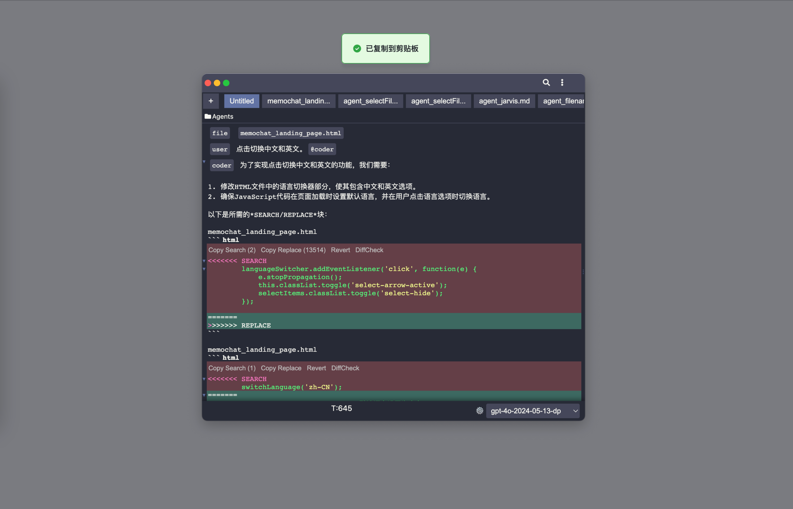

# MemoChat
[English Version](README_EN.md)

MemoChat 是一个集成了文档和聊天功能的智能工作站。它允许用户在对话中自由调整和设置角色，支持多窗口和实时同步，并且可以直接与本地文件交互。

## 功能

- **自由上下文管理**: 体验不受限制的对话管理。MemoChat 允许您在对话中自由调整和设置角色，打破传统的回合制交互模式。
- **多窗口和实时同步**: 在多个窗口中同时处理不同任务。MemoChat 确保所有窗口内容的实时同步，避免信息不一致。
- **本地文件交互支持**: 在 MemoChat 中直接与本地文件交互，无需切换应用程序。
- **Markdown 预览支持**: 在 MemoChat 中，您可以直接预览 Markdown 文档，包括复杂的 mermaid 和 UML 图表。

## MemoChat 快速上手

### 多窗口
- **说明**：MemoChat 支持同时打开多个窗口进行操作。使用 `Cmd + N` 新建窗口。打开的窗口全都是置顶的悬浮框，可能会挡住其他的应用，请使用 `option` `z` 置顶/隐藏所有窗口。

### 触发大模型
- **快捷键**：`Cmd` `=`
- **说明**：在编辑器中输入内容后，按下 `Cmd` `=` 可以触发大模型进行内容生成。

### 中断大模型
- **说明**：在大模型生成过程中，按下任意键可以中断生成，或者鼠标点击编辑框任意处中断大模型。

### Mention 快捷操作
- **说明**：在行首通过 `@` 可以唤起意图选择；
- **system、user、assistant**：用于标记对话角色。
- **file**：用于插入文件内容。输入 `file ` 后可以选择本地文件。
- **recent**：输入 `recent ` 后可以快速访问最近使用的文件。
- **tabs**：输入 `tabs ` 后可以访问当前打开的标签页。
- **clipboard**：输入 `clipboard ` 后可以访问剪贴板历史。
- **temp**：用户临时独立的对话，不使用编辑框中的上下文；
- **blockmatcher**：用于控制大模型的代码块匹配。
- **vscode**：输入 `vscode ` 后可以访问 VSCode 最近打开的文件。
- **diffchecker**：用于检查代码/文本差异。
- **terminal**：输入 `terminal ` 后可以获取当前 terminal 的工作目录（pwd） 信息；
- **workingDir**：输入 `workingDir ` 后可以选择当前工作目录（pwd）的文件插入对话。

### 本地文件交互
- **拖入 VSCode 标签页文件**：支持将文件拖入编辑器进行插入到对话中。
- **SEARCH/REPLACE block**：大模型对指定的文件进行编辑处理，根据 SEARCH block 进行匹配，使用 REPLACE block 进行替换。

### 本地命令行工具交互
- **Terminal**：通过内置终端执行命令行操作。使用 `Cmd + J` 切换显示/隐藏终端。

### Markdown 预览
- **快捷键**：`Cmd + P`
- **说明**：支持 Markdown 内容的实时预览，包括 Latex 数学公式、Mermaid 流程图和 PlantUML 图表。

### 幽灵文本
- **说明**：在编辑器中输入内容后，系统会自动生成建议文本，按 `Tab` 键接受建议。幽灵文本会在光标位置停留 0.5s 秒后开始请求。

### 自定义模型
- **说明**：支持任何符合 OpenAI 请求格式的接口。
- **配置方法**：通过点击底部状态栏的配置按钮，打开`models-config.json` 文件自行配置。
- 暂时内置了 deepseek 模型，该 key 目前是我自己的，每月会充 10 RMB（500w tokens），用完即止，目前使用下来效果还行，如果没有其他选择的话，建议使用该模型。

### 自定义 Agent
- **说明**：在非行首位置通过 `@` 可以唤起自定义 Agent。选中的 agent 的 内容会作为 system prompt 传递给模型。
- 通过将对话文件的文件名设置为 `agent_{agentname}.md`，即可添加 agent，通过 @agentname 即可使用。
- 比如下方的 coder agent，其实是已经内置了一个对话文件为 "agent_coder.md"，该对话文件可以通过 `Cmd` `k` 触发对话历史框搜索查看。
- **@coder**：代码生成助手。
- **@jarvis**：智能助手。
- **@html**：HTML 生成助手。
- **@commander**：命令执行助手。
- **@docer**：文档生成助手。
- **@thinking_process**：思维过程分析助手。

### 选中内容弹出工具栏
- **comment**：选中内容及上文作为 context 进行对话。
- **chat**：仅选中内容作为 context 进行对话。
- **load_file**：选中内容为本地文件地址，加载文件到对话中。
- **load_url**：选中内容为URL，加载网页内容到对话中。
- **exec**：选中内容为 terminal 命令，打开 terminal 执行命令。
	- 假如你希望执行完的结果可以自动复制到剪贴板中，可以在命令后面添加上 `| pbcopy`，比如`cat hello.txt | pbcopy`，方便后续粘贴到对话中。

### 快捷键汇总
- **option + z**：置顶/隐藏所有窗口。
- **Cmd + =**：触发大模型。
- **Cmd + Shift + =**：检索相关文档后触发大模型。
- **Cmd + J**：切换终端。
- **Cmd + T**：新建标签页。
- **Cmd + W**：关闭当前标签页。
- **Cmd + P**：切换 Markdown 预览。
- **Cmd + L**：调整窗口大小，小、中、大。
- **Cmd + N**：新建窗口。
- **Cmd + H**：显示历史对话记录。
- **Cmd + S**：保存当前标签页内容。